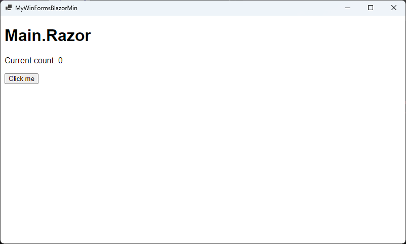

# WinFormsBlazorMinimalAppTemplate
最小限の WinForms Blazor アプリ を作成するためのテンプレート
## 使用法

### テンプレートの取得
[WinFormsBlazorMinApp.nupkg](https://github.com/kznagamori/WinFormsBlazorMinimalAppTemplate/releases/download/v1.0.0/kznagamori.WinFormsBlazorMinApp.1.0.0.nupkg)
をダウンロードします。

### テンプレートのインストール
ダウンロードしたnugetパッケージをインストールします。
```
dotnet new install kznagamori.WinFormsBlazorMinApp.1.0.0.nupkg
```

### 最小限の WinForms Blazor アプリプロジェクトの作成
```
dotnet new winforms-blazor.min -n <プロジェクト名>
```
**例:** `dotnet new wpf-blazor.min -n MyWinFormsBlazorMin`

### テンプレートのアンインストール
```
dotnet new uninstall kznagamori.WinFormsBlazorMinApp
```

### ターゲット

net8.0のみをターゲットとしています。

### ビルド

```
dotnet build
```

### リリースビルド

```
dotnet publish -c Release
```

### 実行

`dotnet run` で実行すると以下の画面が表示されます。



### kznagamori.WinFormsBlazorMinApp.X.X.X.nupkgの作成

```
nuget pack .\WinFormsBlazorMinimalAppTemplate.nuspec
```

